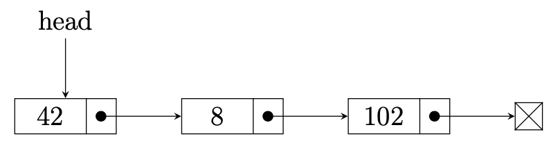

# Programming II

## Lab 6: Computer Repository

### Linked Lists

In this lab, you will serve as IT maintainer for a collection of Saint Mary's College's computers. Unfortunately, there are many such computers to keep track of, and they are currently unorganized. You wish to collect them in a virtual data structure called a **linked list**, for logical storage and retrieval.

You will practice topics related to linked lists in this assignment, including insertion, removal, and retrieval of elements.

### Attribution

This lab is used in CS 222 at Saint Mary's College of California. The concept for this lab was originally based on Dr. Chris Bourke's "Lab 07", which is used in CSCE 156 (Computer Science II) at the University of Nebraska-Lincoln. In 2025, Dr. Sarah Roscoe restructured the lab, and instructions were rewritten.

## Instructions

You are given a class, `ComputerList.java`, with pre-defined methods, but most of them currently throw an `UnsupportedOperationException` which say that it is not yet implemented. You job is to delete the exception and replace it with correct code.

Follow the instructions to implement each missing methods.

1. Clone this lab from Github. Use this link: <https://github.com/sroscoe2/CS222-Lab-06.git> Refer to Lab 1 if you need a refresher for how to do so. REMEMBER: when importing, name your folder `firstnameLI-CS222-Lab-06`
2. [About Linked Lists](#explanations)  Decide what the field(s) for your class should be. Declare the head of your list as a field. Do you want to store the size as a field? Decide as a team.
3. [Implementation Explanation](#implementation) Implement each method of the UML diagram in the theoretical manner discussed in class. [Hints](#hints)

- [OPTIONAL] `getComputerNode(int position)`, which returns a `ComputerNode` -ement corresponding to the given `position`. This is optional, but may help -u with other methods.
- `addToEnd(Computer c)`, which adds the given `Computer` instance to the end - the list.
- `addToStart(Computer c)`, which adds the given `Computer` instance to the -ginning of the list.
- `clear()`, which clears out the contents of the list and makes it an empty -st.
- `getComputer(int position)`, which returns the `Computer` element stored at -e given `position`.
- `getSize()`, which returns the size of the list, the number of elements -rrectly stored in it.
- `print()`, which prints the contents of the list to standard output.
- `remove(int position)`, which removes the `Computer` from the given -osition`, assuming indices start at 0. Implicitly, the remaining elements' -dices are reduced.
- Constructor `ComputerList(params)`

4. Once all methods are implemented, run the JUnit test case suite. Debug any errors until all test cases pass.
5. Zip your project folder and turn it into Canvas. Refer to Lab 1 if you need a refresher for how to do so.

-----

## Explanations

### Why bother?

*Arrays* in Java are static: they have a fixed size and must be manually manipulated as the user needs to insert data, remove data, or resize.

*Lists* in Java provide this functionality but hide such details from the user.

For example, consider an array:

```java
int[] myInts = new int{10,15,18,23,25}
```

If we need to remove the element `15` from the array, we need to do something to the array to update it. We could set `myInts[1]` to the value of 0. But then our array would be `[10,0,18,23,25]`. Wouldn't it make more sense to have `[10,18,23,25]`? If we remove `15`, we'd then need to shift everything from `18` on one space to the left.

However, when we use a List,

```java
List<Integer> myInts = new ArrayList<>();
myInts.add(10); myInts.add(15); myInts.add(18); myInts.add(23); myInts.add(25);
```

we can simply say

```java
myInts.remove(1);
```

And the element is removed. We don't have to worry about *how* it happens.

### Purpose

The purpose of this lab is to construct our own List data type. We will understand what sort of low-level details are needed to complete common List operations. We will do so with object-oriented programming concepts.

### Structure

A linked list is a collection of elements. Each element is called a *node* and contains one item. A node also contains a *reference*, or *link*, to another node. Since each node points to the next, the nodes are linked together, creating a *linked list*.

Since all nodes are linked together, we do not need to have a variable for every possible node. In general, a linked list maintains only a reference to the *head* of the list, the very first node.

<p align="center">

</p>  

The final node in the linked list does contain a reference, it just doesn't point to any particular node. We say that it points to `null`, or *nothing*. `null` is Java's term for nothing.

-----

### Implementation

A linked list class generally has 1-2 simple fields, followed by a constructor, followed by methods that define the list's functionality. It is your job to decide which fields to maintain, and implement methods.

#### Iteration

A general strategy you will need to employ is *iteration*. Iteration is when we repeat a process multiple times. When examining collections, iteration refers to the action of visiting each element of the collection. For example: when we iterate through an array, we visit each position once.

Iteration through linked lists is not as simple as before. We are designing our own list class; we do not yet have the ability to refer to items by indices. We must define what iteration looks like.

Consider what we have at our disposal:

- The head of the list

That doesn't seem like a lot, and we can't *move* through our list with it. But wait! It's a node! Which leads us to a discussion of....

### Node vs. Element

Each item in our linked list is an *element.* For example, if my list contains, in this order: a penny, a dime, a nickel, and a quarter, each of the coins is the element. But each element gets stored in a node.

A node, you'll recall contains both *data* and *references*, also called *links*. That means a node can point us to its next item!

If we have any given node called `a`, we can get the following node (which we'll call `b`) by calling the method

```java
b = a.getNext();
```

To proceed through the loop, we just need to do that more than once!

### For loop vs While loop

This will typically look like

```java
temp = this.head;
for (int i=0; i<this.getSize(); i++){
    temp = temp.getNext();
}
```

or

```java
temp = this.head;
while(temp != null){
	temp = temp.getNext();
}
```

What does this mean? We start with the only node we have access to: the head of the list. We create a variable called `temp` that is the node we currently look at. Then, at each round of iteration, we change the node we are currently looking at to be the *following* node.

The conditions of the two loops are very different. One is an integer `i` which counts up to the size of the list. The other simply checks whether we have reached the end of the list (recall, at the final node in the list, it will have a link that just points to `null`).

Feel free to use these loops as a jumping off point for implementing more difficult operations.

*A Word of Warning:* The head of the list should be one of your fields. However, you should be very cautious about modifying that variable. It would be a shame to lose access to your entire list because you casually lost track of where the head is.

#### Hints

The following are some hints for implementing the class, in no particular order.

- **Fields**. The most simple linked list class only maintains the head of the list. However, there is one additional field you could add which can make your life easier.
- `addToEnd()`. You must first go to the end of the list.
- `addToStart()`. Be careful to not lose access to anything following the head of the list.
- `clear()`. What makes a list a list? What do we have access to?
- `getComputerNode()`, `getComputer()`. These are almost identical in their implementation. But they return different types. One (`getComputer()`) returns the actual *element*, while the other (`getComputerNode()`) returns the *node*.
- **Constructor.** For the test cases, no parameters are required. You may find it useful to add more constructors based on your field(s), however.
