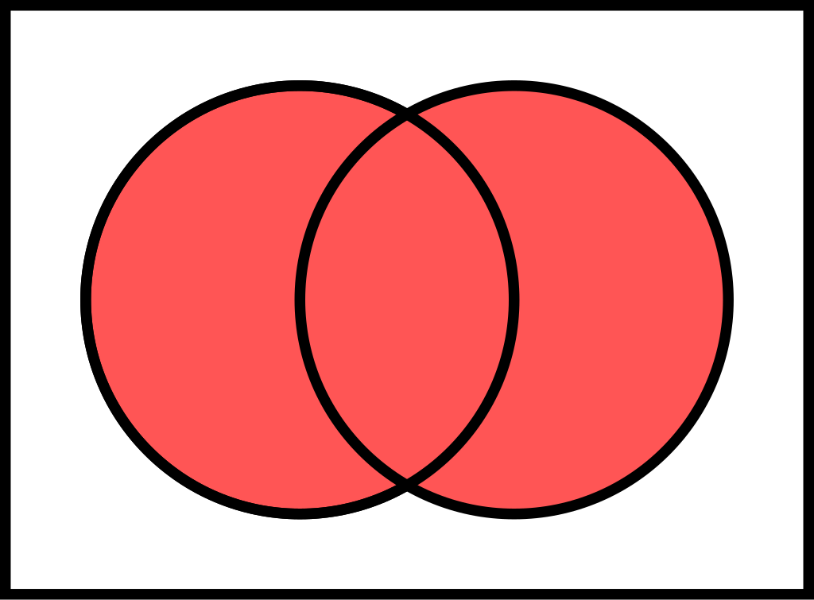
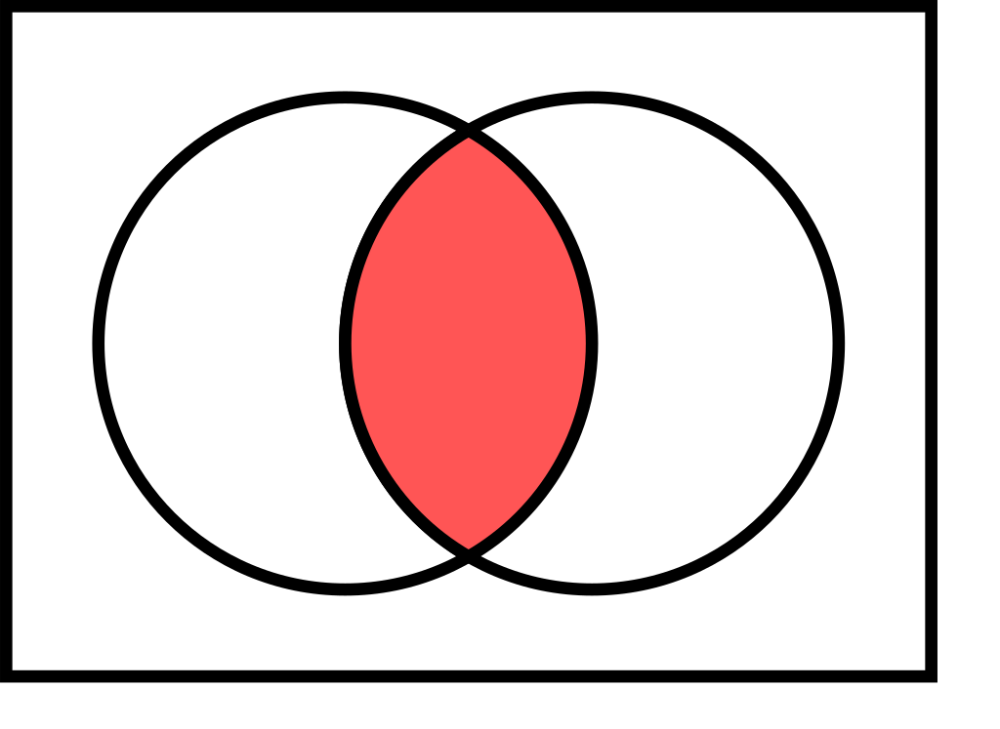

# Programming II

## Lab 6: Linked Lists

In this lab, you will implement some more advanced linked list operations, union and intersection.

# Instructions

1. Clone this lab from Github. Use this link: <https://github.com/sroscoe2/CS222-Lab-06.git> Refer to Lab 1 if you need a refresher for how to do so. If possible: when importing, name your folder `firstnameLI-partnerfirstnameLI-CS222-Lab-06`

2. Decide who among you and your partner(s) will be the driver and navigator for this assignment.

## LL.java

3. Open the project. Review each code file. Discuss with your partner: what is the purpose of each file?

4. [Explanation](#union) [Hints](#union-hints) Implement `union()`.

5. [Explanation](#intersection) [Hints](#intersection-hints) Implement `intersect()`.

6. Run the JUnit tests in `ComputerListTests.java` and ensure all test cases pass.

## Finishing Up

7. Zip your project folder and turn it in to Canvas.

# Explanations

## Union

The *union* of two collections `A` and `B` produces a collection that has all the elements in `A`, plus all the elements in `B`. Any element in common is retained, but not duplicated.

<p align="center">

</p>

Let's look at an example:

```
A = [1, 2, 3, 4]
B = [2, 3, 5, 6]
A union B = [1, 2, 3, 4, 5, 6]
```

And another:

```
A = [1]
B = [5, 6, 7, 8]
A union B = [1, 5, 6, 7, 8]
```

### Union Notes

Typically, we perform the union operation on *sets*, a mathematical structure denoted with curly brackets `{ }`, which do not allow duplicates. So the set `A = {1,1}` would actually be `A = {1}`, since the duplicates are ignored. 

Additionally, sets ignore the order of elements. So the sets `{1,2,3}` and `{2,3,1}` are equivalent. 

In our implementation, we are working with lists, which both have an enforced order and allow duplicates. You will not be given any lists with duplicates. The test cases have been written so that whatever order you have enforced in the union operation, if the appropriate elements are there you will pass the test. 

[Go back to the instructions](#lljava)

### Union Hints

Here are some hints to get you started:

Your job is to modify the `LL<T>` class, by computing the **union** of `this` list with another list, called `b`. You should modify the list *in-place*; that is, any elements in `b` not seen in `this` should be added to `this`.

1. **Draw pictures.** Drawing pictures is an essential component for learning these topics. For every picture you draw relevant to this lab, I will give you 1 pt extra credit.
2. You might want to iterate through `b` to find any elements not found in `this`.
3. `find()` is your friend!

[Go back to the instructions](#lljava)

## Intersection

The *intersection* of two collections `A` and `B` produces a collection that has only the elements both `A` and `B` have in common. Any element that is held by only one of the sets is not retained. If no elements are in common, the result is an empty collection.

<p align="center">

</p>

Let's look at an example:

```
A = [1, 2, 3, 4]
B = [2, 3, 5, 6]
A intersect B = [2, 3]
```

And another:

```
A = [1]
B = [5, 6, 7, 8]
A intersect B = []
```

Similar caveats for union apply to intersections. The tests are written to accept any order the list is in. 

[Go back to the instructions](#lljava)

### Intersection Hints

Here are some hints to get you started:

Your job is to modify the `LL<T>` class, by computing the **intersection** of `this` list with another list, called `b`.

You should modify the list *in-place*.
Any elements not in both `b` and `this` should be removed from `this`.

1. **Draw pictures.** Drawing pictures is an essential component for learning these topics. For every picture you draw relevant to this lab, I will give you 1 pt extra credit.
2. You might want to iterate through `this`, and see if you can find any elements not in `b`.
3. Like before, `find()` is your friend!

[Go back to the instructions](#lljava)

